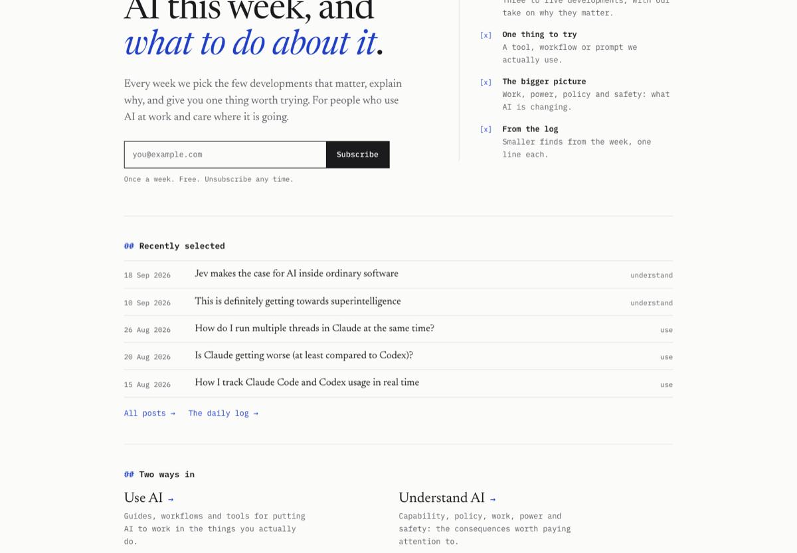

The homepage now leads with the weekly email: a one-line promise, a signup box, what each issue contains, and the latest selected posts, with Use AI and Understand AI as the ways into the archive. It also has a new, quieter look: monospace structure, a serif reading voice and a single blue accent, now carried across every post, reference and log page, which also lose the file-tree sidebar. See it at [wayintoai.com](https://wayintoai.com/).

