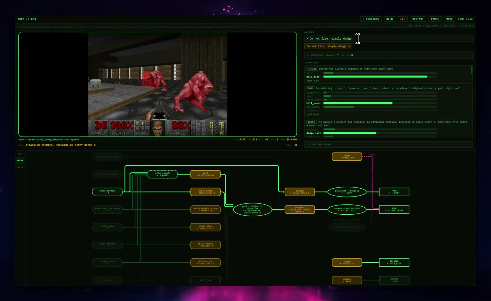

Some model launches promise a more capable assistant. TypeSafe's Jev raises a different possibility: intelligence cheap and fast enough to become an ordinary ingredient in software. If that works, the interesting change will be in the applications people can build around it.

**Launch post:** [Introducing System One Models & Jev](https://typesafe.ai/blog/introducing-system-one-models-and-jev), by TypeSafe founder Diogo Almeida.

On September 15, TypeSafe announced Jev in early access as its first System One model. Founder Diogo Almeida describes the interface succinctly:

> unstructured state in, typed probabilistic decisions out.

The launch introduces a new architecture and parallel sampler, alongside a training method called Reinforcement Learning for Calibrated Decisions, or RLCD. [Read the announcement](https://typesafe.ai/blog/introducing-system-one-models-and-jev).

This deserves attention because the unit of useful AI work can be very small. A piece of software might need to recognize a complaint, assess whether a passage answers a question, or route an ambiguous request. Better judgment at those points could improve the whole application without requiring an agent to run it.

## What you actually ask it to do

The developer supplies the relevant state and narrowly defined questions. Jev understands natural language, but it does not write a response or explain its reasoning. Its current input is text, including JSON objects and arrays; it does not take images, audio, or video. [System One overview](https://docs.typesafe.ai/concepts/system-one).

There are three kinds of question:

| Primitive | Example question | Result |
| --- | --- | --- |
| Choice | Which team should handle this request? | An option, probabilities across the options, and confidence |
| Score | How urgent is this request on our defined scale? | A score, probabilities across the levels, and confidence |
| Noul | Does this message report a service outage? | A probability between zero and one |

These examples are illustrative. You define the answer space and the criteria. Questions in the same request are evaluated independently; if one genuinely needs another's answer, that dependency requires a subsequent request. [Primitive documentation](https://docs.typesafe.ai/primitives).

The recommended programming pattern is to split a broad assessment into small judgments, ask them together, and combine the results in code. TypeSafe says those evaluations run in parallel, so additional questions add little latency. [Introduction](https://docs.typesafe.ai/introduction).

*One of TypeSafe's published workflow examples: narrow probabilistic judgments feed explicit branching and actions in code. [See the launch post](https://typesafe.ai/blog/introducing-system-one-models-and-jev).*

Imagine an issue tracker receiving a bug report. An application could ask whether the report describes data loss, whether reproduction instructions are present, and which product area it concerns. Ordinary code would then set priority and choose a queue. Those are our example decisions, but they show the appeal: the business rule remains visible, and the model supplies the part that requires interpretation.

## Why the probability matters

RLCD targets decisions whose probabilities reflect observed outcomes. In a calibrated system, events assigned an 80% probability should happen about 80% of the time across many predictions. That is a population-level property, not a promise about any one answer. [TypeSafe's AI primer](https://docs.typesafe.ai/introduction/machine-learning-primer).

There is also a distinction between probability and the API's confidence field. For Choice and Score, confidence summarizes how concentrated the returned distribution is. Noul has no separate confidence field. A developer can use uncertainty to route ambiguous cases for review, with thresholds evaluated against the application's own data. [Confidence documentation](https://docs.typesafe.ai/confidence).

That makes an important engineering question explicit: when does the system have enough evidence to act? A useful product can automate the easy cases and surface the difficult ones. Its value depends on how often those categories are separated correctly, not simply on how many answers it returns.

## The performance claims are striking—and specific

TypeSafe reports 193.6× faster and 444.6× cheaper performance in its workflow evaluations, while acknowledging that these figures are toward the upper end of likely real-world gains. Its LLM comparison wrapper asks for probabilities, which adds overhead relative to requesting a discrete answer. [Launch evidence and qualifications](https://typesafe.ai/blog/introducing-system-one-models-and-jev).

The evaluation covers security incidents, agent trace observability, invoice processing, and customer service. It holds the workflow fixed and measures agreement against reference answers derived from GPT-6 Astra and Claude Fable 5.1 at high thinking settings. The comparison models use their providers' default reasoning settings. [Evaluation methodology](https://evals.typesafe.ai/).

*TypeSafe's result across four workflows puts Jev on the cost/accuracy frontier. This is company-reported evidence using model consensus as the reference, not an independent benchmark. [Methodology and qualifications](https://typesafe.ai/blog/introducing-system-one-models-and-jev).*

This measures agreement with a model consensus inside particular workflows. It does not establish correctness against independently verified business outcomes, or show that Jev matches general-purpose models across all tasks. The results are promising evidence for the intended use case; their scope matters when interpreting the headline.

There is a practical route to investigating further: TypeSafe has released a comparison adapter that runs the same style of questions through other providers. It exposes options for native structured outputs, probability or discrete answers, and malformed-output retries. That makes it possible to investigate which comparison is relevant to a particular application. [System One Adapter](https://github.com/typesafe-ai/system-one-adapter-python).

## Doom is the demo that makes the idea click

The launch post's best demonstration is Jev playing Doom. It makes roughly ten queries a second, turning a structured text representation of the game state into decisions quickly enough to react in real time. The model is not looking at pixels, and TypeSafe explicitly says a conventional Doom bot could play better; the point is that the same instruction-following decision interface can operate inside a fast interactive loop.

*Doom runs on the left while Jev's live judgments and the surrounding control graph remain visible on the right and below. Click the image to watch the full demo.*

<iframe src="https://player.vimeo.com/video/1227495732?h=5c335e90e5&title=0&byline=0&portrait=0" style="aspect-ratio: 392 / 240; width: 100%; height: auto;" frameborder="0" allow="autoplay; fullscreen; picture-in-picture; clipboard-write; encrypted-media; web-share" referrerpolicy="strict-origin-when-cross-origin" title="Jev playing Doom"></iframe>

*Watch the embedded demo above, [open it on Vimeo](https://vimeo.com/1227495732/5c335e90e5), or see it in [TypeSafe's launch post](https://typesafe.ai/blog/introducing-system-one-models-and-jev).*

That is more revealing than another classification example. If model calls become cheap and quick enough to sit inside a game loop, they can also sit inside interfaces, monitors, simulations, and other software that cannot wait seconds for a generated answer. TypeSafe also shows Jev [Wikiracing](https://vimeo.com/1227495711/88074bcc80), choosing among hundreds or thousands of links at each step.

## Type safety does not make a decision true

A fixed answer space prevents the model from inventing an extra category. It cannot prevent choosing the wrong category. A system that routes a security incident to the wrong team has made a consequential mistake even if its response is perfectly well formed.

TypeSafe's own Jev 1.13 limitations page makes this concrete. It describes unreliable arithmetic and date comparisons, sensitivity to irrelevant context, and susceptibility to adversarial text. It also warns that logically related questions need not produce probabilities satisfying the identities a developer might expect. The page was last reviewed September 17. [Known limitations](https://docs.typesafe.ai/model-jaggedness/jev-1.13).

That is a useful corrective to sweeping claims about eliminating hallucination. We should assess the proposed guarantee narrowly: constraining the form and possible values of an answer removes some failures, while semantic errors still need to be measured. Permissions, exact calculations, and final action rules remain responsibilities of the application.

## Why this is worth featuring

My reading is that Jev points toward a productive division of work: code handles explicit rules, a decision model handles narrow judgments, and more capable generative systems or people handle the cases that need further reasoning. The benefit would be easier inspection as well as speed. A developer could identify which judgment caused a bad outcome and change that part of the system.

The compelling question now is how well the economics and uncertainty estimates hold up on other people's workloads. A useful independent evaluation would measure end-to-end latency, cost per correctly handled case, and the errors left among cases the application accepts automatically. Those are the numbers that determine whether a launch becomes dependable infrastructure.

This is an announcement worth watching closely. It offers a concrete way to put AI judgment into ordinary software, and enough documentation to start asking serious questions about whether it delivers.

*This is an analysis of the announcement and public documentation, checked September 18, 2026, rather than a hands-on test. See the [Jev reference entry](../ref/typesafe-jev.md) for the source links and a compact overview.*
